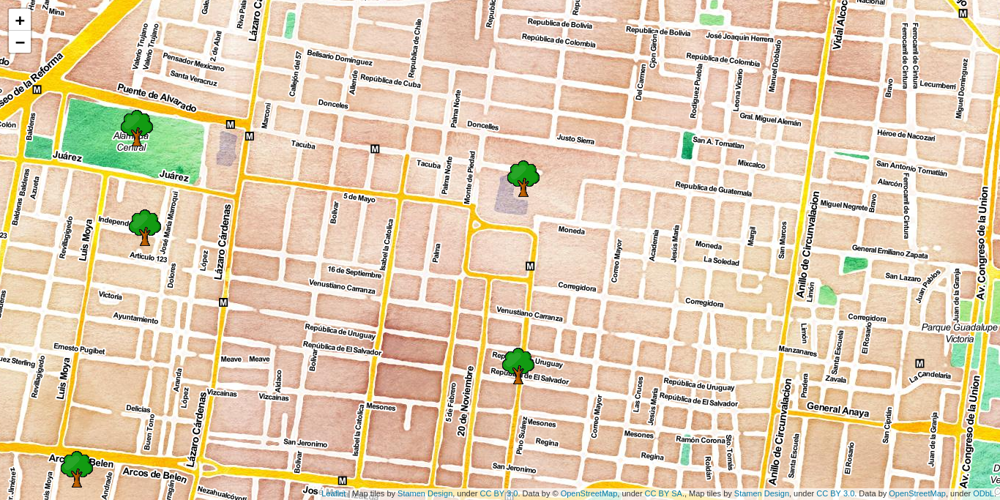

# mapas
Ejemplos de mapas con distintas librerías y lenguajes de programación

<b>Mapas en Python</b>
  
<ul>
  <li><a href="https://github.com/marceloprates/prettymaps" target="_blank" rel='noreferrer noopener'>prettymaps</a></li>
    
  
   
  
   
  
    
  <li><a href="https://github.com/python-visualization/folium" target="_blank" rel='noreferrer noopener'>folium</a></li>
    
  
</ul>

<b>Mapas en R</b>
<ul>
  <li><a href="https://github.com/rstudio/leaflet" target="_blank" rel='noreferrer noopener'>leaflet</a></li>
</ul>

<b>Mapas en Javascript</b>
<ul>
  <li><a href="https://github.com/Leaflet/Leaflet" target="_blank" rel='noreferrer noopener'>leaflet</a></li>
</ul>

<b>Mapas en React</b>
<ul>
  <li><a href="https://github.com/PaulLeCam/react-leaflet" target="_blank" rel='noreferrer noopener'>leaflet</a></li>
</ul>
